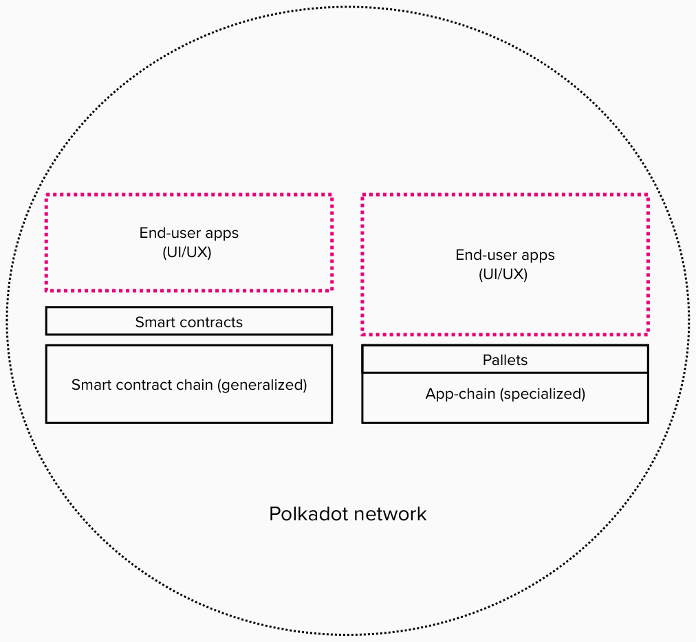

In the Polkadot ecosystem there are primarily two approaches for creating, minting and managing non-fungible assets:

1. **Using smart contracts** (e.g. ERC-721, ERC-1155, PSP-34) and deploying them on EVM/Wasm compatible app-chains
2. **Using app-chains**, i.e. chains that specialize in providing services for creating and managing non-fungible assets

 

App-chains on Polkadot are built with [Substrate](https://docs.substrate.io) &mdash; a blockchain SDK built in Rust. More colloquially called Parachains, they contain custom low-level modules that when combined make up the overall business logic and services provided by the chain.

Substrate has a framework to make it easy to create such modules, called [FRAME](https://github.com/paritytech/substrate/frame). 
You can think of it like this: Substrate is to FRAME as NodeJS is to React.💡

> In FRAME, these modules are referred to as **pallets** and the amalgamation of pallets (a.k.a the business logic of a chain) is referred to as the app-chain's **runtime**.

There's a [number of app-chains](https://wiki.polkadot.network/docs/learn-nft#nfts-20-nfts-in-polkadot--kusama) on Polkadot that use specialized FRAME pallets to offer NFT capabilities for their users.
The most commonly used pallet in production is the [Uniques pallet](https://github.com/paritytech/substrate/tree/master/frame/uniques) which offers basic and secure functionality for managing non-fungible assets and has been extended by app-chain engineering teams to meet their users' needs.

**However, it became apparent that these pallets were fairly limited in functionality and weren't able to meet the emerging use cases for non-fungible assets in the broader web3 ecosystem.** 

Some of these limitations were:
- It was not possible for users to mint items from an existing collection
- There were no built-in features for buying and selling items
- Collections were not designed to meet cross-chain use cases

The [NFTs pallet](https://github.com/paritytech/substrate/tree/master/frame/nfts) was designed to address some of these limitations. It’s new features provide a multitude of configurations for collection creators and collectors, putting end-users at the forefront of its design decisions. Continue reading the next section to discover what those are.